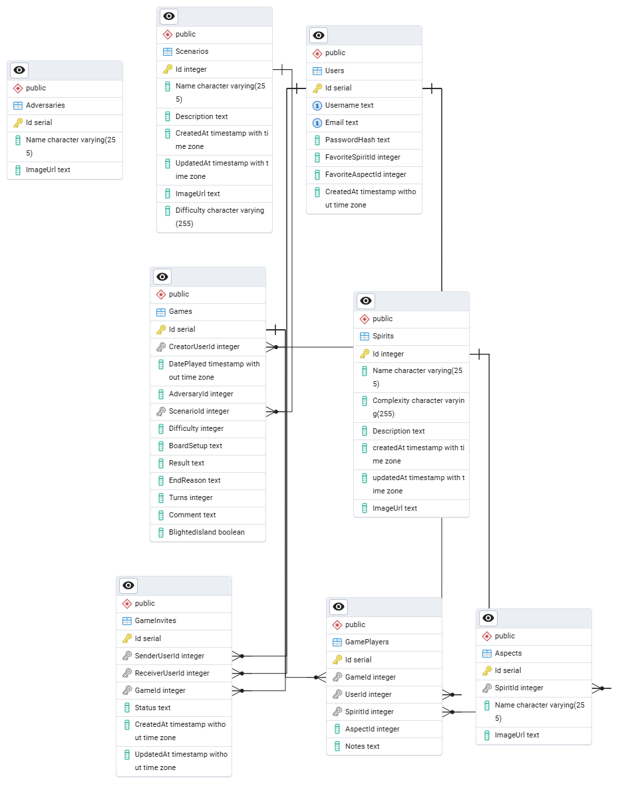
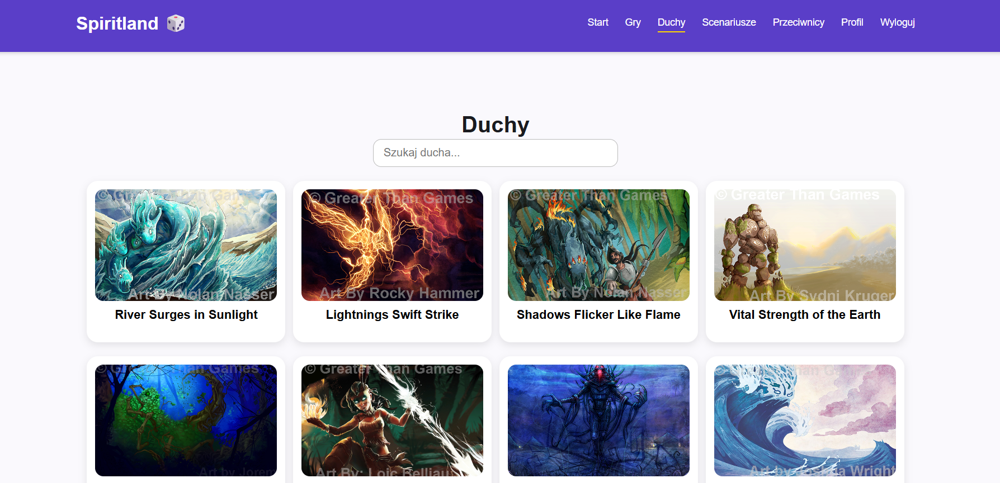
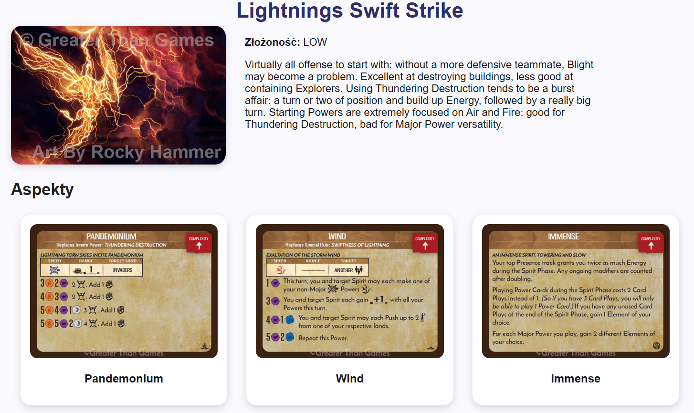
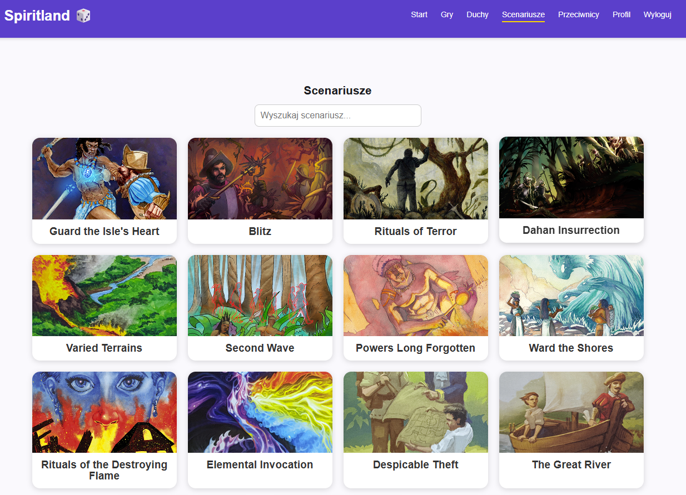
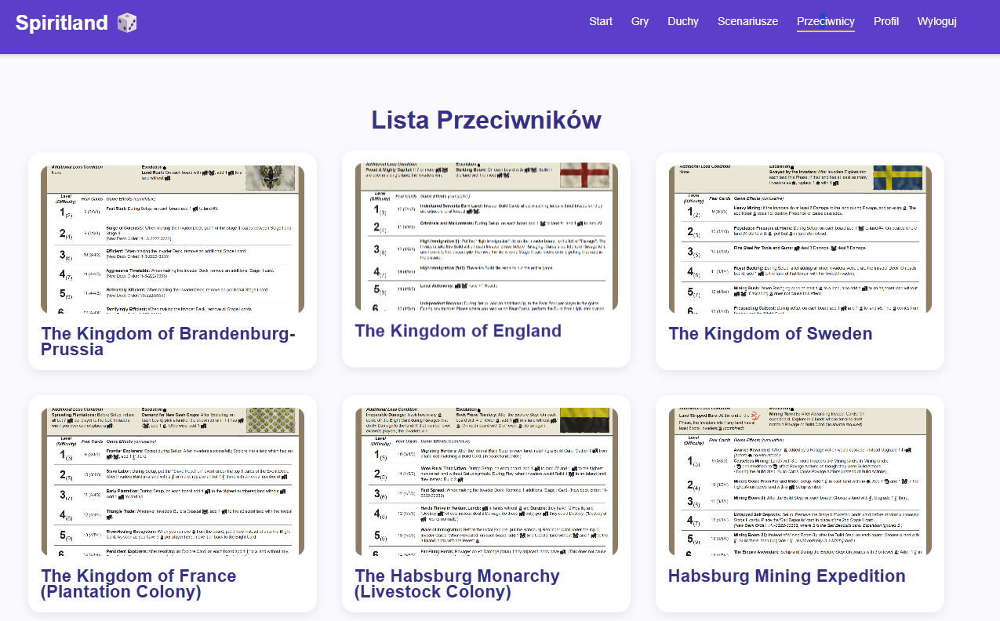

Spirit Island Score Tracker

Aplikacja webowa do zapisywania, przeglądania i współdzielenia wyników z gry planszowej Spirit Island.
Projekt składa się z frontendowej aplikacji Angular, backendu ASP.NET Core oraz bazy danych PostgreSQL.
Aplikacja umożliwia prowadzenie profilu gracza, tworzenie i edycję partii, zarządzanie duchami, aspektami, przeciwnikami i scenariuszami.

Spis treści

Opis projektu

Funkcje

Stos technologiczny

Architektura

Wymagania systemowe

Instalacja i uruchomienie

Struktura projektu

Modele danych

Opis projektu:

Spirit Island Score Tracker to aplikacja wspierająca graczy Spirit Island w rejestrowaniu i analizowaniu przebiegu ich rozgrywek.
Projekt umożliwia:

zapisywanie szczegółów każdej partii,

przegląd historii gier na poziomie użytkownika,

współdzielenie partii i zapraszanie innych graczy,

zarządzanie listami duchów, aspektów, przeciwników i scenariuszy.

Aplikacja jest przygotowana do działania jako narzędzie indywidualne oraz społecznościowe, z możliwością dalszej rozbudowy.

Funkcje

1. Konta użytkowników

Rejestracja i logowanie (JWT / Identity).

Profil użytkownika: nazwa, ulubiony duch z aspektem, data rejestracji.

Edycja profilu i zmiana hasła.

2. Interakcje użytkowników

Wyszukiwanie użytkowników po nazwie.

Podgląd profilu i ostatnich rozgrywek.

3. Duchy i aspekty

Lista duchów z opisami i poziomem złożoności.

Lista aspektów przypisanych do każdego ducha.

Wybór ulubionego ducha w profilu.

4. Przeciwnicy

Lista przeciwników, ich poziomy trudności i opisy.

5. Scenariusze i tryby gry

Lista scenariuszy (np. Blitz, The Great River).

6. Tworzenie i współdzielenie partii

Tworzenie nowej partii i zapraszanie graczy.

Wspólna edycja: każdy gracz edytuje swoje dane (duch, wynik, notatki).

Zaproszenia do udziału w partii.

7. Szczegóły rozgrywki

Każda partia zawiera:

datę,

listę graczy,

ducha i aspekt każdego gracza,

wybranego przeciwnika + poziom,

scenariusz (jeśli użyty),

stan wyspy (zarażona / normalna),

wynik (wygrana / przegrana),

powód zakończenia (Fear Victory, Blight Loss, itp.),

liczbę tur, komentarze, opis układu planszy.

8. Wyszukiwanie i filtrowanie

Filtracja gier po duchu, scenariuszu, poziomie trudności, przeciwniku, uczestniku, wyniku.

Stos technologiczny
Frontend

Angular 17

TypeScript

SCSS

Angular Router

JWT Auth

Reactive Forms / Template Forms

Backend

ASP.NET Core 8 (Web API)

Entity Framework Core

JWT Authentication

Clean Controller structure

Baza danych

PostgreSQL

pgAdmin

9. Screeny aplikacji
   Diagram bazy danych
   
   Pogląd duchów
   
   Szczegóły ducha
   
   Pogląd scenariuszy
   
   Pogląd przeciwników
   
